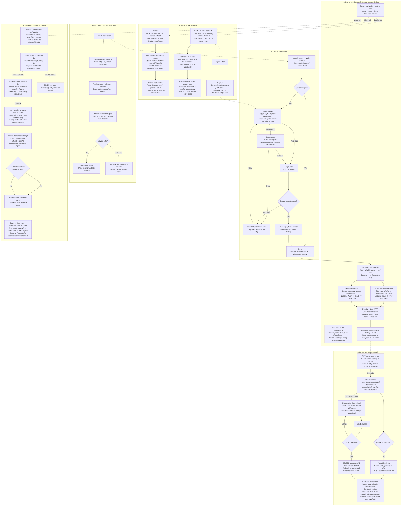

# Absensi Kopdes — Full Application Flow (Mermaid Diagram)

> **Cara Import ke FigJam / Eraser:**
> 1. **FigJam:** Tambahkan widget **Mermaid** dari tab Plugins/Widgets, lalu *paste* seluruh blok kode Mermaid di bawah ini.
> 2. **Eraser.io:** Buat diagram baru, pilih mode diagram syntax (Mermaid), lalu *paste* kodenya.
> 3. **Export ke PDF:** Anda bisa menggunakan viewer Markdown (seperti VS Code Markdown PDF, Notion, atau [Mermaid Live Editor](https://mermaid.live)) lalu klik *Download/Print to PDF*.

---

